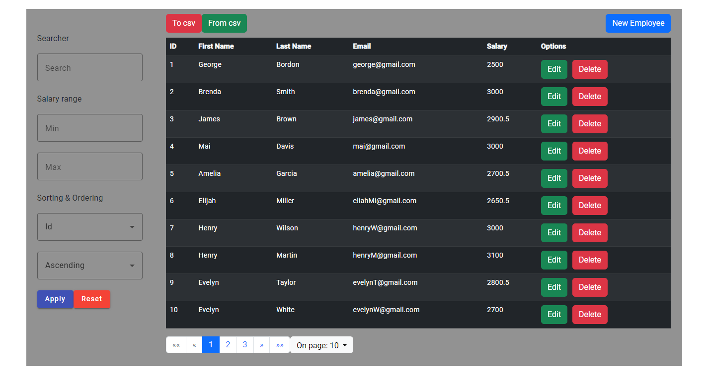
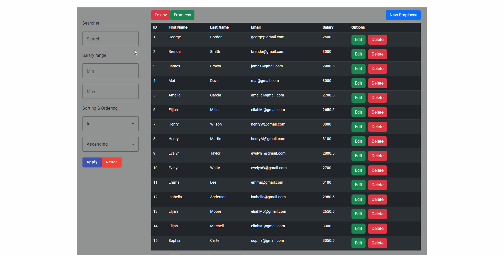
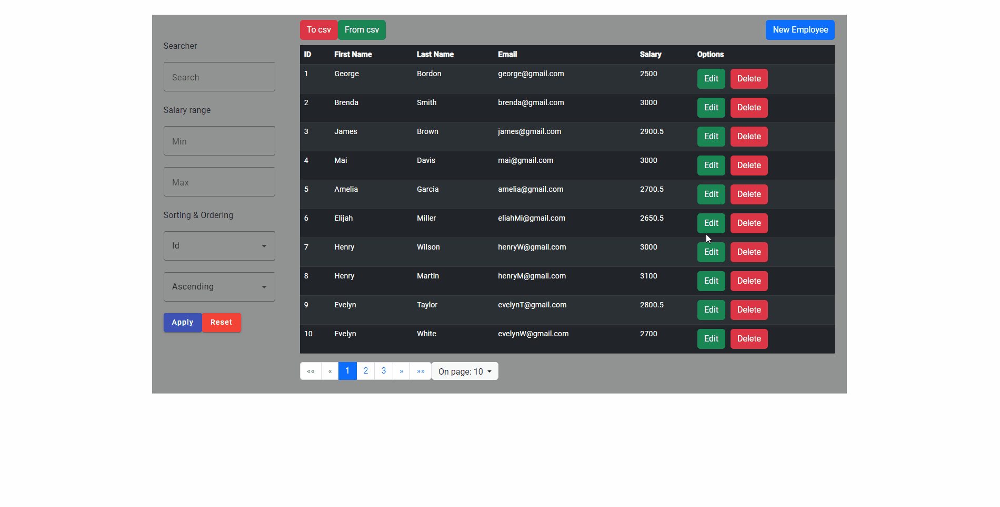
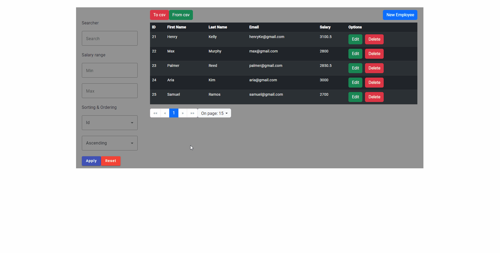
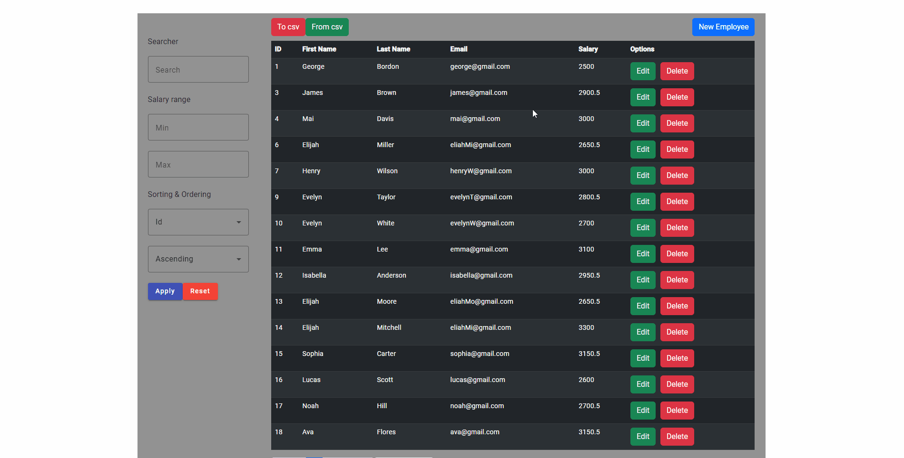
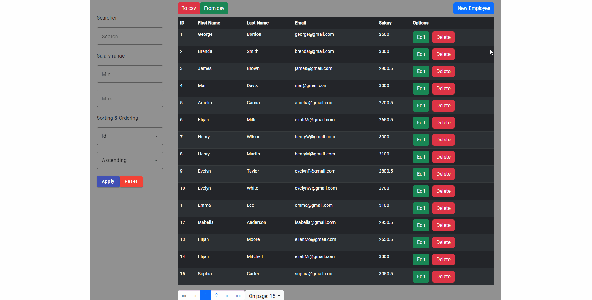
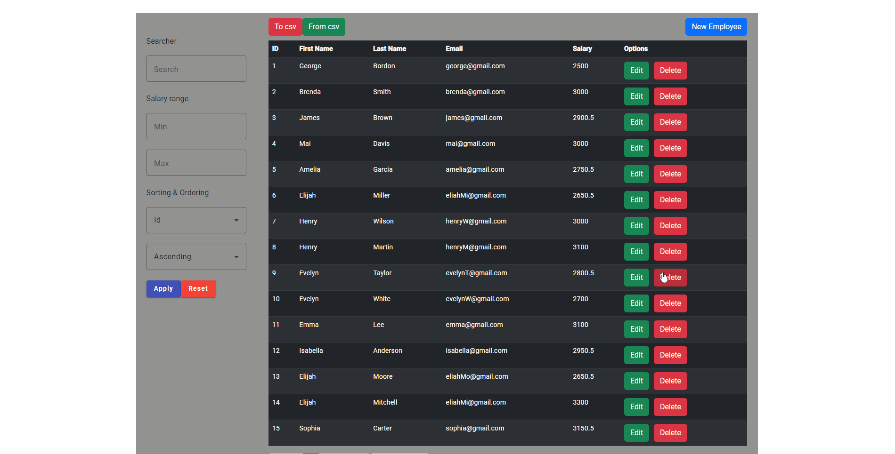

# About <a name="About"></a>

Single page Frontend-Backend application to manage your entity, based on employees example.




# Table of Contents
1. [About](#About)
2. [Functionalities](#Functionalities)
3. [Technologies](#Technologies)
4. [How to run](#How-to-run)
5. [Usage Example](#Usage-Example)
5. [Summary](#Summary)

# Functionalities <a name="Functionalities"></a>

1. Fully paginated content connected with database.
2. Implemented Criteria Api to enable advanced filtering.
3. Allows to load entity data from .csv file.
4. Allows to download entity data to .csv file.
5. Dialogs.
6. Alerts.

# Technologies <a name="Technologies"></a>

## Backend

- Spring Boot / Java
- Maven
- H2
- Commons-csv

## Frontend

- Angular
- Angular Materials
- Bootstrap

# How to run <a name="How-to-run"></a>

## Backend

1. Build maven project from ```EmployeeManagementSystem\SpringBackend\pom.xml``` and load dependencies.
2. Run BackendModuleApplication class
   from ```EmployeeManagementSystem\SpringBackend\src\main\java\com\example\springbackend\SpringBackendApplication.java```.

## Frontend

1. Go to path ```EmployeeManagementSystem\AngularFrontend``` and run ```npm install``` to install needed packages.
2. Use command: ```ng serve``` to run the Angular module.

Default address of frontend server is  http://localhost:4200.

# Usage Example <a name="Usage-Example"></a>

Run http://localhost:4200/ in your browser.

### Pagination
The data you get are paginated, by default 15 per page.
Allows you to set page size as you want.


### Filtering
You can filter the data by every column besides id.
Allows to mix parameters, sort and order the data as you want.


### Export to .csv
Allows you to export the data to .csv file.


### Import from .csv
You can insert your data into database with .csv file.


In case your file has wrong extension you will receive an error.


### Crud operations

Example of adding entity.


Example of editing entity.


Example of deleting entity.


# Summary <a name="Summary"></a>

I'm constantly learning new things, and I wanted to practice a bit of my frontend skill. (doesn't exist) :3
I hope you find this project useful.
Use freely.